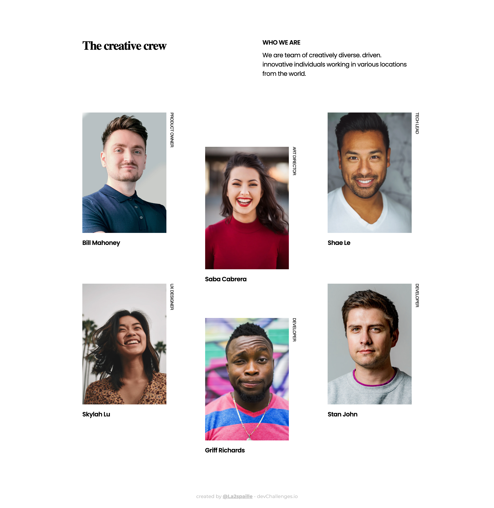
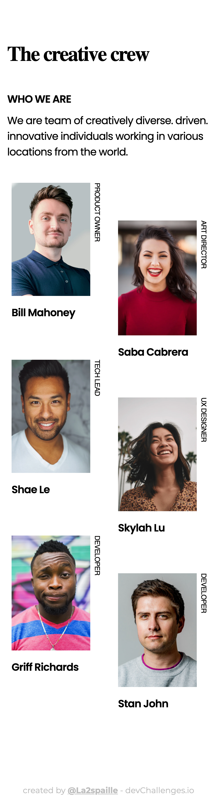

<h1 align="center">my-team-page-master-By-La2spaille</h1>

   Solution for a challenge from  <a href="http://devchallenges.io" target="_blank">Devchallenges.io</a>.

  <h3>
    <a href="https://my-team-page-master-by-la2spaillevercel.app/">
      Demo
    </a>
     | 
    <a href="https://github.com/la2spaille/my-team-page-master-By-La2spaille">
      Solution
    </a>
     | 
    <a href="https://devchallenges.io/challenges/hhmesazsqgKXrTkYkt0U">
      Challenge
    </a>
  </h3>

## Table of Contents

- [Overview](#overview)
  - [Built With](#built-with)
- [Features](#features)
- [Contact](#contact)

## Overview

### Built With

- HTML
- CSS

## Features

This application/site was created as a submission to a [DevChallenges](https://devchallenges.io/challenges) challenge. The [challenge](https://devchallenges.io/challenges/hhmesazsqgKXrTkYkt0U) was to build an application to complete the given user stories.

## Contact

- GitHub [@l2spaille](https://github.com/la2paille)
- Twitter [@la2spaille](https://twitter.com/la2spaille)
